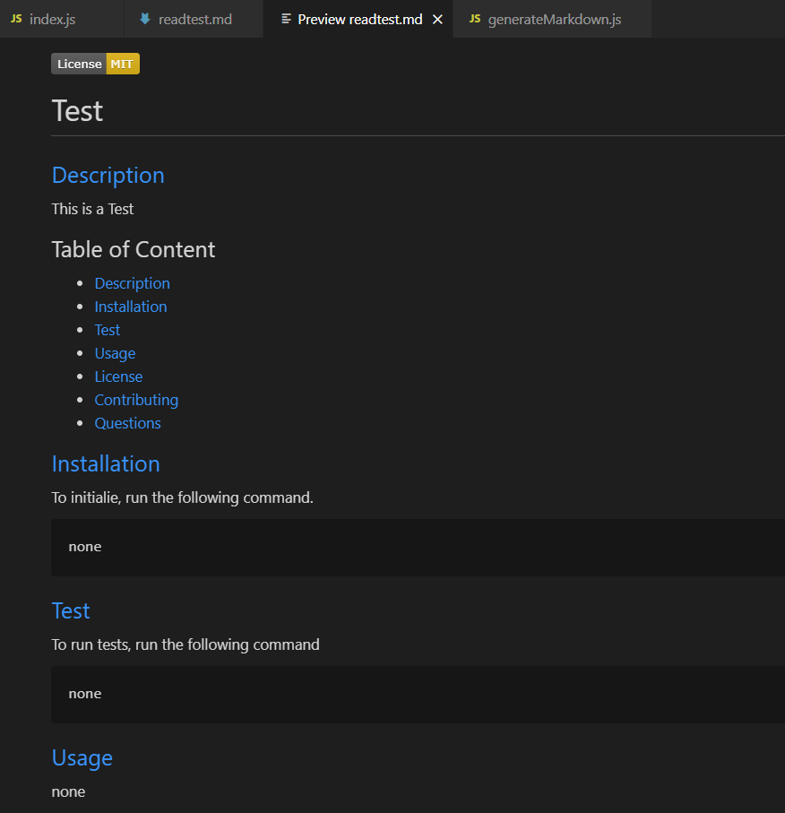

# Homework Unit Nine: Readme Generator

## [Description](#description)

In this homework I created a readme generator to create a high-quality README for a new project. This application uses a command-line that accepts user input. 

The application asks a series of questions to the user to input. After all questions are responded the readme is generated. The readme has a table of contents with links to areas of the readme. The readme has the following sections, title, description, installation, usage, license, sontributing, tests, and questions. When the user choses a type of license, then a badge is generated at the top of the page, and a link to the coresponding license is provided on the license area.

Here is a screencapture video demostrating the functinality of the [application](https://watch.screencastify.com/v/EwMaCsGJX6D2LahB6aA6).

## Table of Content

* [Description](#description)
* [Installation](#installation)
* [Test](#test)
* [Usage](#usage)
* [License](#license)
* [Contributing](#contributing)
* [Questions](#questions)

## [Installation](#installation)
To initialie, run the following command.

    node index.js

## [Test](#test)
To run tests, run the following command

    none, no test are provided at this moment.

## [Usage](#usage)

This application is good to use when generating a readme for any project. 

## Screenshot of Readme generator:

## [License](#license)

[MIT](https://opensource.org/licenses/MIT) License.

## [Contributing](#contributing)

There is no contibution at this time.

## [Questions](#questions)

If you have any questions about the repo, or would like to contact me directly, 
here is my email: maibel.montes4@gmail.com. You can find more of my work at [Maribel Montes](https://github.com/MaryMD98).

